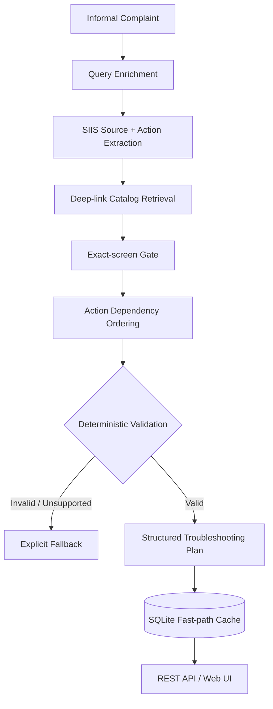

# Smart Guided Troubleshooting Engine

*Turning informal Galaxy complaints into safe, actionable, and device-aware troubleshooting plans.*

**Samsung PRISM Generative AI Hackathon**  
**3rd Edition 2026–27**  
**Theme 2**  

### Team Details
*   **Team Name:** Neural Bits
*   **College:** SRMIST Kattankulathur, Chennai
*   **Members:** 
    *   Mayank Dadheech (md6074@srmist.edu.in)
    *   Ritwik Swarnkar (rs4415@srmist.edu.in)
    *   Arartika Lahiri (al4151@srmist.edu.in)
    *   Harshit Agarwal (ha4020@srmist.edu.in)
*   **Submission GitHub:** [https://github.com/hedoescode-mayank/PRISM_GENAI_HACKATHON_Y2026.git](https://github.com/hedoescode-mayank/PRISM_GENAI_HACKATHON_Y2026.git)

---

## 1. Problem Statement

When users experience technical issues with their Galaxy devices, they rarely use precise technical terminology. Instead, they describe problems informally, such as:
- *"My screen is cracked and flashes intermittently."*
- *"My phone rings, but the screen stays black."*
- *"I know the setting exists, but I don't know where to find it."*

This creates a complex support challenge. The system must navigate from an informal complaint through issue interpretation, knowledge retrieval, safe action selection, exact device routing, and verification. 

The challenge brief outlines that this manual interpretation and navigation triage takes roughly **15 minutes per scenario**. The problem statement target is to build an automated engine that can return actionable plans in **under 300 ms** for previously encountered issues (Note: these are the challenge's problem-statement targets, not our final end-to-end system results).

## 2. Our Solution

The engine accepts an informal complaint and converts it into a structured troubleshooting plan backed by supplied troubleshooting knowledge and a validated deep-link catalog. Instead of allowing generated text to directly determine device actions, the system applies deterministic retrieval, routing, ordering, and validation before returning the result.

**Pipeline Flow:**  
`Complaint` → `Query Enrichment` → `SIIS Retrieval / Extraction` → `Catalog Retrieval` → `Exact-Screen Resolution` → `Action Ordering` → `Validation` → `Structured Plan` → `Cache / REST API`

## 3. Why This Is Not Just An LLM Wrapper

This is not a generic AI chatbot. **Generation is treated as untrusted.**

*   **Separation of Concerns:** Language flexibility (understanding the user) is strictly separated from action authority (deciding what the device should do).
*   **Source-Backed Evidence:** All troubleshooting content must be derived from the supplied source evidence.
*   **Enrichment as an Aid:** Query enrichment is used solely as a retrieval aid, not as a source of new evidence or facts.
*   **Strict Routing:** Deep-links must exactly match the supplied catalog. Exact-screen routing actively rejects broad or parent-menu substitutions.
*   **Dependency Ordering:** Extracted actions are explicitly dependency-ordered (e.g., backing up data before factory reset).
*   **Schema Enforcement:** Strict schema validation occurs before the response is returned. Web links (URLs) are completely rejected.
*   **Safe Fallbacks:** Unsupported cases gracefully fall back to an explicit empty context (no match) instead of hallucinating fabricated actions.

## 4. Architecture



**System Modules:**
*   `enrichment.py`: Normalizes colloquial text into a canonical technical query and generates variations.
*   `extraction.py`: Parses unstructured reference text into a structured goal object containing atomic steps.
*   `retrieval.py`: Maps step groups to specific device settings screens using lexical and character n-gram scoring.
*   `ordering.py`: Ensures correct action hierarchy (e.g., non-invasive settings first, critical/destructive last).
*   `validation.py`: Enforces strict Pydantic schemas, URL constraints, and exact field syntax.
*   `cache.py`: Manages the SQLite fast-path cache for previously encountered valid plans.

## 5. Knowledge & Data Sources

Troubleshooting actions and steps are derived strictly from supplied source material; the engine does not fabricate unsupported device actions.

Based on the actual implemented repository data (`theme02_input.txt`, `reference_navigation.json`):
*   **Deep-link Catalog:** 578 catalog records (577 actionable URIs and one reserved placeholder).
*   **SIIS Corpus:** 20 complaint / SIIS reference pairs.
*   **Benchmarks:** Local benchmark evaluations (`benchmark-results.json`) and 20-case kit evaluations (`kit-evaluation-results.json`).

## 6. Deep-Link Safety

The engine resolves actions explicitly against the supplied catalog (`reference_navigation.json`). Deep-links are never freely generated URLs. 

*   Exact-screen matching is strictly enforced. The catalog's masked Bixby URIs are copied as supplied. The reserved `bixby://dummy_positive` URI can be used for a vetted concrete Settings screen named in a literal SIIS path after exact catalog lookup fails.
*   Unsupported or unresolved routing correctly results in a fallback state (`fallback: "no_match"`) rather than silently redirecting to a random or generic setting.

*Note: Device-specific URI execution depends on a supported Samsung environment; the prototype exposes the link and graceful fallback behavior without claiming successful execution on a non-Samsung browser.*

## 7. Action Ordering & Safety

Extracted actions are categorized based on their safety and impact:
*   `auto`: Recommended action (Standard configuration screens reachable via deep-link).
*   `manual`: Manual step (Physical interventions, wiping, replacing hardware).
*   `critical`: Important safety step (Disruptive/irreversible operations like factory reset or firmware update).

The system enforces safe action ordering. For example, if a user reports physical screen damage, the system orders **Back Up Phone Data** (a safe, necessary prerequisite) before **Schedule Screen Repair Service** (a manual step).

## 8. Validation

The final response is returned **only after deterministic checks pass**. The validation layer (`validation.py`) enforces:
*   Pydantic response schema conformance.
*   Deep-link catalog integrity (must exactly match known catalog entries).
*   Zero-leak URL constraint (absolute prohibition of `http`, `https`, `www` links).
*   Action hierarchy and group structure rules.

## 9. Caching & Fast Path

A persistent SQLite cache (`.cache/`) enables a fast-path resolution for previously encountered issues. 
*   Valid, source-guarded plans are fingerprinted and stored.
*   A query matching a cached semantic footprint bypasses the full extraction pipeline.
*   The cache provides a massive latency reduction for repeated issues. 

**Measured Results (Localhost benchmark, see `benchmark-results.json`):**
*   **Cold Request (p95):** ~21.5 ms (In-process pipeline)
*   **Cached Request (p95):** ~0.7 ms (In-process pipeline)

*(Note: These figures exclude process startup, remote network traffic, and model provider inference delays).*

## 10. Tech Stack

| Layer | Technology |
| :--- | :--- |
| **Engine** | Python 3.10+ |
| **Retrieval** | Lexical + Character n-gram scoring |
| **Validation**| Pydantic v2 |
| **API** | Python HTTP Server (`api.py`) |
| **Cache** | SQLite (`cache.py`) |
| **Runtime** | Docker |
| **UI** | Vanilla HTML/CSS/JS (Samsung One UI Inspired) |
| **Testing** | Pytest |

## 11. Run it

Requires Python 3.10 or newer. From this directory:

```bash
./scripts/bootstrap
./scripts/doctor
./scripts/test
./scripts/run
```

In another terminal:

```bash
curl -sS http://127.0.0.1:8000/health
curl -sS http://127.0.0.1:8000/v1/troubleshoot \
  -H 'Content-Type: application/json' \
  -d @examples/theme02_black_screen_request.json
```

Optional container run:

```bash
docker build -t samsung-theme02 .
docker run --rm -p 8000:8000 samsung-theme02
```

## 12. Evaluation & Artifacts

Verified HTTP artifacts: 
*   [black-screen request](https://github.com/hedoescode-mayank/PRISM_GENAI_HACKATHON_Y2026/blob/main/examples/theme02_black_screen_request.json) and [response](https://github.com/hedoescode-mayank/PRISM_GENAI_HACKATHON_Y2026/blob/main/examples/theme02_black_screen_response.json)
*   [cracked/flashing-screen request](https://github.com/hedoescode-mayank/PRISM_GENAI_HACKATHON_Y2026/blob/main/examples/theme02_sample_damage_request.json) and [response](https://github.com/hedoescode-mayank/PRISM_GENAI_HACKATHON_Y2026/blob/main/examples/theme02_sample_damage_response.json). The second response demonstrates a catalog-backed backup action with its paired validation deep link, followed by manual service.

Run `./scripts/benchmark` for a local 30 cold / 30 cached request latency report using the supplied Galaxy S24 Ultra complaint. It reports both in-process pipeline timing and localhost HTTP round trips. Process and server startup are excluded.

Run `./scripts/evaluate-kit` to process all 20 lines of `theme02_input.txt` and the paired SIIS JSON queries separately. It reports matched plans, explicit no-matches, validation failures, and mapping gaps. A high match count alone does not establish that a plan is relevant to the user's symptom.

Run `./scripts/export-results` to regenerate [the 20-line JSONL response artifact](https://github.com/hedoescode-mayank/PRISM_GENAI_HACKATHON_Y2026/blob/main/examples/theme02_results.jsonl) from the actual input file. Every line is a validated API response, including explicit no-match rows.

The latest [benchmark report](https://github.com/hedoescode-mayank/PRISM_GENAI_HACKATHON_Y2026/blob/main/benchmark-results.json) and [20-case report](https://github.com/hedoescode-mayank/PRISM_GENAI_HACKATHON_Y2026/blob/main/kit-evaluation-results.json) are included for review.
