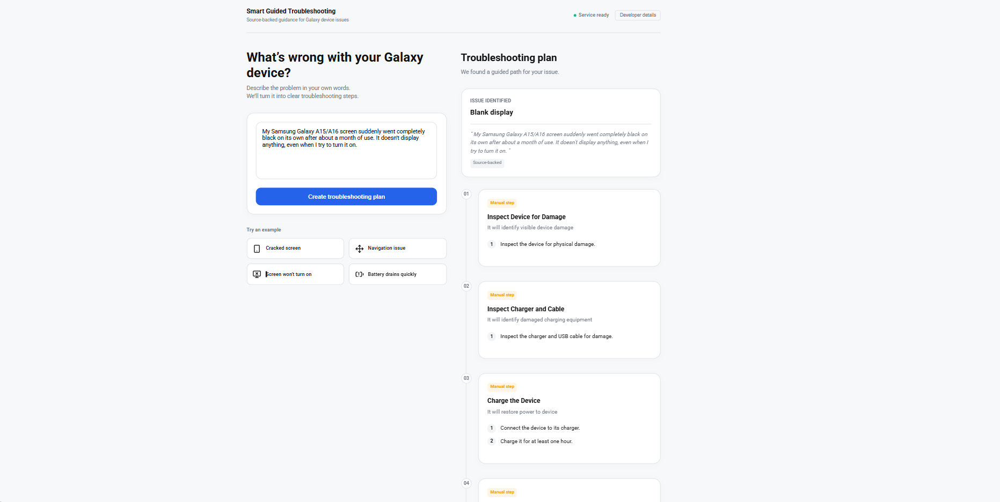
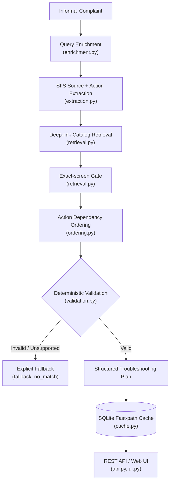

# Smart Guided Troubleshooting Engine

> Turning informal Galaxy complaints into safe, actionable, and device-aware troubleshooting plans.

**Samsung PRISM Generative AI Hackathon | 3rd Edition 2026-27 | Theme 02**

---

| | |
| :--- | :--- |
| **Team** | Neural Bits |
| **College** | SRMIST Kattankulathur, Chennai |
| **Member 1** | Mayank Dadheech (md6074@srmist.edu.in) |
| **Member 2** | Ritwik Swarnkar (rs4415@srmist.edu.in) |
| **Member 3** | Arartika Lahiri (al4151@srmist.edu.in) |
| **Member 4** | Harshit Agarwal (ha4020@srmist.edu.in) |
| **Repository** | [hedoescode-mayank/PRISM_GENAI_HACKATHON_Y2026](https://github.com/hedoescode-mayank/PRISM_GENAI_HACKATHON_Y2026) |
| **Presentation** | [Google Drive (PPT)](https://docs.google.com/presentation/d/1MRMmZjbTeTrRWGfs9O5P5pdXghFAcPSJ/edit?usp=drive_link&ouid=106014727809161104757&rtpof=true&sd=true) |
| **Demo Video** | [YouTube](https://youtube.com/watch?v=qMPpPkZngw8&feature=shared) |

---

## Product UI



---

## 1. Problem

Users describe Galaxy device issues informally:

- *"My screen is cracked and flashes intermittently."*
- *"My phone rings, but the screen stays black."*
- *"I know the setting exists, but I don't know where to find it."*

The support challenge requires navigating from an informal complaint through issue interpretation, knowledge retrieval, safe action selection, exact settings/device routing, and verification.

**Problem-statement context (challenge targets, not project results):**
- The challenge brief describes manual interpretation/navigation as roughly **15 minutes per scenario**.
- The problem statement specifies a target of **under 300 ms** for previously encountered issues through a fast path.

---

## 2. Our Solution

The engine accepts an informal complaint and converts it into a structured troubleshooting plan backed by supplied troubleshooting knowledge and a validated deep-link catalog. Instead of allowing generated text to directly determine device actions, the system applies deterministic retrieval, routing, ordering, and validation before returning the result.

```
Complaint
  -> Query Enrichment
    -> SIIS Retrieval / Extraction
      -> Catalog Retrieval
        -> Exact-Screen Resolution
          -> Action Ordering
            -> Validation
              -> Structured Plan
                -> Cache / REST API
```

**This is not just an LLM wrapper. It is a controlled bridge from natural language to verified device action.**

---

## 3. Why This Is Not Just an LLM Wrapper

**Generation is treated as untrusted.**

| Principle | Implementation |
| :--- | :--- |
| Language flexibility separated from action authority | Query enrichment aids retrieval; it never becomes evidence for device actions |
| Source-backed evidence | All troubleshooting content derived from supplied SIIS source material |
| Strict catalog routing | Deep-links must exactly match the supplied catalog; broad/parent-menu substitutions rejected |
| Dependency-ordered actions | Safe/reversible actions first, critical/destructive operations last |
| Schema enforcement | Pydantic v2 strict validation before returning any response |
| Zero URL leakage | Web links (`http`, `https`, `www`) absolutely prohibited in output |
| Explicit fallback | Unsupported cases return empty contexts (`no_match`) instead of fabricated actions |
| Guarded cache | Cached plans are fingerprinted against source and catalog state |

---

## 4. Architecture



### Pipeline Stages

| Stage | Module | What it does |
| :--- | :--- | :--- |
| **Query Enrichment** | `enrichment.py` | Normalizes colloquial text into a canonical technical query; generates 9 paraphrase variations as retrieval aids (never as new evidence) |
| **SIIS Retrieval** | `data.py`, `pipeline.py` | Finds the corresponding supplied SIIS content for the complaint, or accepts explicit `siis_response` context |
| **Action Extraction** | `extraction.py` | Parses unstructured SIIS reference text into structured action drafts with atomic steps |
| **Catalog Retrieval** | `retrieval.py` | Ranks catalog metadata with lexical and character n-gram scoring; maps step groups to specific device settings screens |
| **Exact-screen Gate** | `retrieval.py` | Rejects broad/parent-menu substitutions; requires exact screen match from catalog |
| **Action Ordering** | `ordering.py` | Topological sort by dependency graph and disruptiveness; safe/reversible first, critical last |
| **Validation** | `validation.py` | Pydantic schema conformance, deep-link catalog integrity, zero URL leakage, action structure rules |
| **Cache** | `cache.py` | SQLite-backed fast-path cache with source/catalog fingerprint guards |
| **API & UI** | `api.py`, `ui.py` | REST endpoints and Samsung One UI-inspired web interface |

---

## 5. Knowledge & Data Sources

> Troubleshooting actions and steps are derived from supplied source material; the engine does not fabricate unsupported device actions.

| Asset | File | Details |
| :--- | :--- | :--- |
| Deep-link Catalog | `data/deeplinks.json` | 578 catalog records (577 actionable Bixby URIs + 1 reserved placeholder) |
| SIIS Corpus | `data/siis_responses.json` | 20 complaint / SIIS reference pairs |
| Complaint Input | `data/theme02_input.txt` | 20 real-world complaint lines for evaluation |
| Reference Fixtures | `data/reference_navigation.json`, `data/reference_sample.json` | Golden contract-test cases (PDF navigation example, screen-damage example) |
| Schema Definition | `src/samsung_engine/schema.py` | Strict Pydantic v2 schema following the Theme02_Input_Kit contract |
| Benchmark Artifact | `benchmark-results.json` | 30 cold + 30 cached latency measurements |
| Evaluation Artifact | `kit-evaluation-results.json` | 20-case matched/no-match evaluation report |

---

## 6. Deep-Link Safety

This is a key theme requirement. The engine resolves actions exclusively against the supplied catalog.

- Deep-links are **never freely generated** URLs. Every actionable link must exist in `data/deeplinks.json`.
- **Exact-screen matching** is enforced. Broad or parent-menu URIs are rejected.
- The reserved `bixby://dummy_positive` placeholder is restricted to vetted concrete Settings screens named in literal SIIS paths after exact catalog lookup fails. Its description and message name that screen in 5-7 words.
- Unsupported or unresolved routing returns `fallback: "no_match"` rather than silently substituting a random setting.

> Device-specific URI execution depends on a supported Samsung environment; the prototype exposes the link and graceful fallback behavior without claiming successful device execution.

---

## 7. Action Ordering & Safety

Actions are categorized by safety and impact:

| Category | Frontend Label | Description |
| :--- | :--- | :--- |
| `auto` | Recommended action | Standard configuration screens reachable via deep-link |
| `manual` | Manual step | Physical interventions, wiping, replacing hardware |
| `critical` | Important safety step | Disruptive/irreversible operations (factory reset, firmware update) |

**Ordering logic** (implemented in `ordering.py`):

```
Safe / reversible actions (low disruptiveness)
  -> Verification where available
    -> Manual / critical actions (high disruptiveness)
```

**Example:** For a cracked-screen complaint, the system orders **Back Up Phone Data** (safe prerequisite) before **Schedule Screen Repair Service** (manual step). This is enforced by the dependency graph, not by convention.

---

## 8. Validation

> The final response is returned only after deterministic checks pass.

The validation layer (`validation.py`) enforces:

- **Response schema conformance** (Pydantic v2 strict mode, `extra="forbid"`)
- **Deep-link catalog integrity** (every `actionableDeeplink` must exactly match a known catalog entry)
- **Zero-leak URL constraint** (regex scan for `http`, `https`, `www` across entire serialized response)
- **Action structure rules** (no duplicate actions, critical actions ordered last, manual actions cannot carry deep-links, auto actions must carry deep-links)
- **Validation deep-link pairing** (validation links must be paired with their catalog-backed action)
- **Fallback validation** (matched plans must not carry a fallback; empty contexts require explicit fallback metadata)

---

## 9. Caching & Fast Path

The SQLite cache (`.cache/plans.sqlite3`) enables fast-path resolution for previously encountered issues.

- Valid, source-guarded plans are **fingerprinted** using a composite key of SIIS source hash and extracted procedure shape hash.
- A query matching a cached footprint bypasses the full extraction pipeline.
- Cache entries are **source/catalog guarded**: two complaints that reference the same SIIS article but extract different procedure subsets receive separate cache entries.

**Measured latency** (from `benchmark-results.json`, 30 iterations each, Galaxy S24 Ultra black-screen complaint, excluding process/server startup):

| Path | Cold p50 / p95 / p99 | Cached p50 / p95 / p99 |
| :--- | ---: | ---: |
| In-process pipeline | 20.6 / 21.5 / 21.6 ms | 0.5 / 0.7 / 0.8 ms |
| Localhost HTTP round trip | 22.0 / 23.2 / 27.1 ms | 1.7 / 1.9 / 1.9 ms |

Both cold p95 and cached p95 meet the challenge targets (cold p95 <= 8000 ms; cached p95 <= 300 ms).

---

## 10. 20-Case Kit Evaluation

From `kit-evaluation-results.json` (all 20 lines of `theme02_input.txt`):

| Metric | Result |
| :--- | :--- |
| Input cases | 20 |
| Matched plans | 10 |
| Explicit no-match | 10 |
| Validation failures | 0 |
| Mapping gaps | 0 |
| Schema-valid (matched) | 10 / 10 |

All 10 matched plans passed the supplied schema. All 10 no-match cases returned explicit `fallback: "no_match"` with empty contexts. Zero validation failures.

> A high match count alone does not establish that a plan is relevant to the user's symptom. The 10 no-matches are explicit coverage gaps, not validation errors.

---

## 11. Tech Stack

| Layer | Technology |
| :--- | :--- |
| **Language** | Python 3.10+ (3.12-slim Docker base) |
| **Schema & Validation** | Pydantic v2 (`>=2.5,<3`) |
| **Retrieval** | Lexical + character n-gram scoring with exact-screen gate |
| **API** | Python `http.server` (stdlib) |
| **Cache** | SQLite |
| **Container** | Docker |
| **UI** | Vanilla HTML / CSS / JS (Samsung One UI-inspired, light-first) |
| **Testing** | Pytest (32 tests across 4 test files) |

---

## 12. API

### `GET /health`

Returns service status and loaded catalog count.

### `POST /v1/troubleshoot`

Accepts a complaint and returns a structured troubleshooting plan.

**Request:**
```json
{
  "query": "The mobile phone screen is cracked and flashes intermittently."
}
```

**Optional field:** `siis_response` (string) - explicit SIIS reference text to use instead of automatic lookup.

**Verified example artifacts:**
- [Black-screen request](examples/theme02_black_screen_request.json) / [response](examples/theme02_black_screen_response.json)
- [Cracked/flashing-screen request](examples/theme02_sample_damage_request.json) / [response](examples/theme02_sample_damage_response.json)
- [20-line JSONL evaluation output](examples/theme02_results.jsonl)

---

## 13. Run It

Requires Python 3.10 or newer.

```bash
./scripts/bootstrap        # Install dependencies
./scripts/doctor           # Verify catalog, SIIS, references loaded
./scripts/test             # Run 32 tests
./scripts/run              # Start API + UI on port 8000
```

Then open [http://127.0.0.1:8000](http://127.0.0.1:8000) in a browser, or call the API:

```bash
curl -sS http://127.0.0.1:8000/health
curl -sS http://127.0.0.1:8000/v1/troubleshoot \
  -H 'Content-Type: application/json' \
  -d '{"query": "The mobile phone screen is cracked and flashes intermittently."}'
```

**Docker:**
```bash
docker build -t samsung-theme02 .
docker run --rm -p 8000:8000 samsung-theme02
```

**Evaluation scripts:**
```bash
./scripts/benchmark        # 30 cold + 30 cached latency report
./scripts/evaluate-kit     # Process all 20 input-file complaints
./scripts/export-results   # Regenerate 20-line JSONL response artifact
```

---

## 14. Current Limitations

These are explicitly acknowledged, not hidden.

- **Coverage:** 10 of 20 supplied complaints currently return `no_match`. This is explicit coverage, not a validation error.
- **No hosted model:** The service is fully deterministic and does not use a hosted LLM or network calls. Retrieval uses lexical and character n-gram scoring; BM25, dense embeddings, and on-device deep-link viability testing are not implemented.
- **No live device state:** No Galaxy device state or deep-link execution is available in this local environment. The reserved `bixby://dummy_positive` URI does not demonstrate a working device link.
- **Retrieval scope:** Retrieval uses metadata lexical and character n-gram scoring with an exact-screen gate. It does not include BM25, dense embeddings, or semantic similarity models.
- **Plan relevance:** The 10 matched plans passed structural validation and limited complaint/action review. Broader human review remains necessary before customer use.
- **Multi-intent:** The splitter handles selected independent symptoms and multiple explicit SIIS Settings paths. It is not comprehensive.
- **Scores:** Plan scores are heuristic and uncalibrated, not measured diagnostic probabilities.
- **Paraphrase cache:** The semantic paraphrase cache-hit target has not been measured on a held-out query set.

---

## 15. Roadmap

| Priority | Integration Point |
| :--- | :--- |
| **High** | Dense embedding retrieval (BM25 / sentence-transformers) for broader coverage |
| **High** | On-device deep-link execution verification via Samsung Knox / Bixby runtime |
| **Medium** | Live device-state integration for validation deep-link verification |
| **Medium** | Expand SIIS corpus beyond the 20 supplied complaint pairs |
| **Medium** | Multi-intent handling for compound complaints |
| **Low** | Calibrated confidence scoring from retrieval + extraction signals |
| **Low** | Semantic paraphrase cache with measured held-out query performance |

---

## Repository Structure

```
samsungv1/
  src/samsung_engine/
    api.py              # HTTP server and REST endpoints
    benchmark.py        # Latency benchmark runner
    cache.py            # SQLite fast-path cache
    data.py             # Data loading and catalog management
    doctor.py           # Environment and data health check
    enrichment.py       # Query normalization and variation generation
    evaluate_kit.py     # 20-case evaluation runner
    export_results.py   # JSONL result exporter
    extraction.py       # SIIS text to structured action extraction
    ordering.py         # Action dependency graph and topological sort
    pipeline.py         # End-to-end troubleshooting pipeline
    retrieval.py        # Catalog retrieval with exact-screen gate
    schema.py           # Pydantic v2 strict schema definitions
    state.py            # Device-state provider abstraction
    ui.py               # Web UI (Samsung One UI-inspired)
    validation.py       # Deterministic validation layer
  data/
    deeplinks.json      # 578 Bixby deep-link catalog records
    siis_responses.json # 20 SIIS reference pairs
    theme02_input.txt   # 20 complaint lines for evaluation
    reference_*.json    # Golden contract-test fixtures
  tests/                # 32 Pytest tests across 4 files
  scripts/              # bootstrap, doctor, test, run, benchmark, evaluate-kit, export-results
  examples/             # Verified request/response pairs and JSONL evaluation output
  Dockerfile            # Python 3.12-slim container
  pyproject.toml        # Project metadata and dependencies
```
